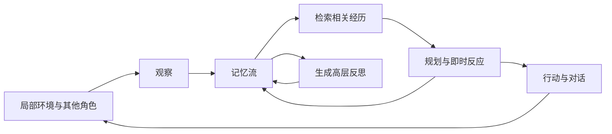

# Generative Agents 学习总结与实验复现路线

本文对应周日课程阅读的 *Generative Agents: Interactive Simulacra of Human Behavior*，作者为 Joon Sung Park 等，发表于 UIST 2023。依据本地 [22 页论文全文](2304.03442v2.pdf)，覆盖正文、图表及附录 A/B；复现入口另核对了作者 GitHub。本文是便于复习和动手的总结，原有精读笔记保留。

核心结论：把模型放进持续变化的环境后，长期连贯性需要一套管理经历的架构。论文将观察、记忆检索、反思和规划连接起来，使 25 个虚拟角色能够在两天游戏时间中传播消息、建立关系并参与聚会。它证明的是这一实验环境中的行为可信度，不是对真实人类社会的预测准确度。

## 1 论文究竟解决什么问题

一个模型很容易写出某个人在某一刻会说的话，却未必记得昨天答应了什么，也未必能让全天行动保持一致。不断把完整聊天记录放进上下文会碰到容量、干扰和检索问题；只保留摘要又可能丢失重要细节。

论文采用 Smallville 作为试验环境：作者手工设计地图、25 个人物背景及初始关系，模型负责基于各自经历生成行为。并非从零训练 25 个模型，也不是多智能体强化学习。人物差异主要来自初始设定、记忆和局部环境，底层使用论文当时的 ChatGPT 模型。

“涌现”需要准确理解：作者没有逐项编写邀请、装饰、约会和出席的剧本，但提供了初始目标与人物关系。例如 Isabella 想办派对，Maria 喜欢 Klaus。这是有种子条件的行为生成，不是完全无设定的自发社会。

## 2 架构如何运转



### 记忆流保存经历，检索决定当前能用什么

记忆记录包含自然语言内容、创建时间和最近访问时间。观察、反思和计划都会进入记忆流，所以它不只是聊天历史。（§4.1，PDF 第 8–9 页）

检索综合三个维度：

| 维度 | 论文实现 | 容易误解的地方 |
|---|---|---|
| Recency | 按距离上次检索的游戏小时数指数衰减，因子 0.995 | 不仅看事件发生时间；最近被取出的旧记忆也会获得新近性 |
| Importance | 模型在写入时评 1–10 分 | 是模型判断的重要性，不是客观事实可信度 |
| Relevance | 查询与记忆 embedding 的余弦相似度 | 相关不等于真实，也不等于重要 |

三个分数分别做 min-max 归一化后加权求和，论文三个权重都取 1，再选择上下文预算容纳的高分记忆。复现时需核对代码是否与论文参数一致，不能只抄公式。

### 反思把具体经历变成可复用的判断

原始经历能说明“见过谁、做过什么”，反思用于形成“我在乎什么、谁与我志趣相投”。流程是：最近事件的重要性累计超过阈值 150 后，从最近 100 条记录提出 3 个高层问题；以问题检索记忆，再生成带证据编号的洞见，写回记忆流。论文中通常每天触发两三次。（§4.2，PDF 第 9–10 页）

图 7 展示了递归反思：读论文、做笔记、和馆员交流等经历，被合成为“投入研究”的自我认识。反思也可以引用早先反思，因此需要沿引用关系追溯原始观察。

学习判断：这里的 reflection 主要是概括与推断，不等同于调试里的查错。论文没有提供每条推断都成立的保证。图中更强的措辞可作为检查推断是否超出证据的线索，但不能据此宣布已测得“置信度通胀”。

### 规划维持跨时间一致性，反应允许修改计划

若每一刻独立问模型该干什么，它可能连续安排三次午饭。论文先生成一天的 5–8 个大块，再按需细化为小时级、5–15 分钟级行动。计划包含时间、地点和持续时长。（§4.3，PDF 第 10–12 页）

遇到新观察后，模型决定继续原计划还是作出反应；需要时重排后续日程。对话也用双方各自检索的记忆和已有对话作条件，不是两个没有状态的角色提示词闲聊。

附录 A 还有两个工程细节：缓存人物摘要；只及时展开近期计划。两者有助于减少反复生成，而不是提前把全天每一步都算好。

### 环境是结构化世界，不是直接看游戏截图

地图被表示为区域、房间和对象的树。每个角色掌握自己已知的子树，模型逐层选择行动地点，传统寻路负责移动，服务器同步对象状态。（§5，PDF 第 12–13 页）

因此，今天 Lab 的视觉模型调用不是复现这篇论文的必需组件。原实验的感知入口主要是结构化环境转成的文字。

## 3 两组实验分别证明了什么

### 受控访谈评测

作者设置五类问题：自我认识、记忆、计划、反应、反思，每类 5 题，共 25 题，附录 B 给出了问题与示例回答。100 位评价者对五种条件的回答进行可信度排序。（§6，PDF 第 13–15 页）

| 条件 | TrueSkill 均值 |
|---|---:|
| 完整架构 | 29.89 |
| 不访问反思 | 26.88 |
| 不访问反思与计划，只用观察记忆 | 25.64 |
| 众包人员扮演角色作答 | 22.95 |
| 不访问观察、反思和计划记忆 | 21.21 |

这些是排序模型的评分，不是正确率。人类条件是众包角色扮演基线，作者明确说明不代表人类专家上限。

最重要的复现细节：所有模型条件来自完整架构运行两天后积累的经历，在访谈阶段限制不同记忆类型的访问。不是每个条件分别模拟两天。若分别运行，行为轨迹和接触的信息会不同，那是另一种值得做、但不同于原论文的实验。

### 两天小镇实验

| 测量 | 论文结果 | 复现时检查的证据 |
|---|---|---|
| 竞选消息传播 | 知情角色从 1/25 到 8/25 | 回答是否知情，并回查获知消息的对话 |
| 派对消息传播 | 知情角色从 1/25 到 13/25，含发起者 | 区分发起者、听说的人和实际参与者 |
| 关系形成 | 相互认识网络密度从 0.167 到 0.74 | 双方是否认识彼此，再核对记忆 |
| 派对协调 | 12 位受邀者中有 5 位到场 | 对照活动时间、地点与实际行动日志 |

关系问答中，论文报告 453 条回答有 6 条幻觉，约 1.3%。这些结果是该次部署的描述性测量，不保证每次运行都得到相同人数。（§7，PDF 第 15–17 页）

## 4 局限与原笔记中需要校准的判断

1. **有记忆不代表会正确检索。** Tom 记得要在派对讨论选举，却不确定派对是否存在，说明局部片段可能被取出而关键上下文遗漏。
2. **回答可以在真实记忆上加料。** 例如给竞选消息添加没有发生的公告安排，或把小镇里同名人物和现实历史人物混淆。
3. **环境常识不能代替环境规则。** 角色误判浴室容量、关门时间，提示我们应明确表达并执行世界约束。
4. **过度配合可能侵蚀人物一致性。** 作者观察到过分正式的对话和很少拒绝别人建议的行为；与指令微调的关系是论文提出的解释，不是单独控制实验确定的因果。
5. **两天不足以说明长期稳定性。** 更长周期、更多重复运行及不同模型仍需检验。论文还讨论记忆篡改、提示注入、偏差、拟人依赖和替代真人研究的风险。（§8）

原笔记“没有 verifier，也没有 ground truth”应缩小范围：系统没有通用的在线事实验证闸门，但评测并非没有依据。作者回查了传播消息和关系声明的记忆记录；行动日志也可用于验证是否到场。行为可信度的主观评分，与局部事实是否有证据，可以同时存在。

Tom 私下不喜欢 Sam、当面却表达支持，不足以单独证明系统自相矛盾；礼貌、社交策略或状态变化也是候选解释。要判断人物漂移，应查时间顺序、检索上下文与完整轨迹。

## 5 与今天提示工程 Lab 的关系

这篇论文把 Lab 中的技巧接成了一个持续运行的系统：

| Lab 概念 | 在论文中对应的机制 |
|---|---|
| Role prompting | 人物身份、关系与初始记忆 |
| Prompt chaining | 观察、检索摘要、决策、行动和对话的串联 |
| 分解与递归 | 全天计划逐步展开；反思树逐层概括 |
| 带环境反馈的循环 | 行动改变环境，新观察影响后续行为 |
| 评测 | 不只读一段好看的输出，而是核对历史、计划、行动与访谈 |

工程启发：人格来自设定与经历共同作用；检索控制角色当下可使用的证据；反思会影响后续检索；规划把跨时间承诺变成可执行安排。模型之外的这些环节，才是复现时应逐一观察的对象。

## 6 官方 GitHub 与兼容性

官方仓库：[joonspk-research/generative_agents](https://github.com/joonspk-research/generative_agents)。这是论文第 2 页直接给出的仓库，包含模拟后端和小镇前端。阅读入口是 [README](https://github.com/joonspk-research/generative_agents#readme)。

已核对的依赖文件锁定了 `openai==0.27.0`、`Django==2.2` 等旧版本。API 封装还使用 `openai.ChatCompletion.create`、`openai.Completion.create` 和 `openai.Embedding.create`，其中写有旧模型名称。这意味着不能假定安装最新版 SDK 就能运行，也不能假定所有旧模型仍对当前账户可用。

来源：[requirements.txt](https://github.com/joonspk-research/generative_agents/blob/main/requirements.txt)、[gpt_structure.py](https://github.com/joonspk-research/generative_agents/blob/main/reverie/backend_server/persona/prompt_template/gpt_structure.py)。本次未实际安装或调用接口，具体兼容性尚未验证。

如果换模型或更新 embedding，应记录为适配版复现；更换 embedding 后需确保旧缓存与新向量使用同一模型及维度，不能混算相似度。保留原始代码版本及修改差异，便于解释结果变化。

## 7 建议的复现顺序

以下阶段划分和验收标准是本次学习建议。启动入口依据官方 README，尚未在本机实跑。

### 第一步 先跑通三人小镇

克隆后记录提交版本，建立独立环境；官方测试版本为 Python 3.9.12，安装前核对本机可用版本与依赖兼容性。

```bash
git clone https://github.com/joonspk-research/generative_agents.git
cd generative_agents
git rev-parse HEAD
python3.9 -m venv .venv
source .venv/bin/activate
python -m pip install -r requirements.txt
```

按 README 配置后端 `utils.py` 的路径变量。密钥建议由环境变量读取，而不是写入可提交文件。首次启动前先验证一次文本调用和一次 embedding 调用，以区分接口问题和模拟逻辑问题。

两个终端都激活环境，分别从仓库根目录进入：

```bash
# 终端 A
cd environment/frontend_server
python manage.py runserver
```

```bash
# 终端 B
cd reverie/backend_server
python reverie.py
```

后端选择 `base_the_ville_isabella_maria_klaus`，新模拟命名为 `ga-study-001`。打开 `http://localhost:8000/simulator_home` 并保持页面打开。可按 README 加载三人历史 `agent_history_init_n3.csv`；先检查初始存档，避免重复注入。

从 `run 10` 开始，检查动作、观察和文件是否更新，随后用 `fin` 保存退出。官方步长是每步 10 秒游戏时间；短跑只用于检查管线，不能期待出现派对或足够多的反思。

验收：至少一条新观察有记录，行为推进且可保存恢复，错误不是被默认回答掩盖。记录请求数、token、重试次数和耗时，再决定扩大运行规模。

### 第二步 追踪一个角色的完整证据链

选择 Isabella 或 Klaus，逐项记录：

- 当前观察是什么，写入了哪条记忆。
- 某次决策取出了哪些记忆，分别为什么得分高。
- 反思引用哪些底层记录，是否把计划误当成已经发生的事实。
- 日程何时被打断，修改后是否仍能履行原有约定。
- 对话声称知道的事情，能否追溯到获知它的经历。

建议每条审计记录包含模拟 ID、角色、游戏时间、模块、输入证据 ID、输出、验证结果。先人工审计少量样例，再考虑自动化统计。

### 第三步 做 25 人两天的行为复现

官方提供 `base_the_ville_n25` 和 `agent_history_init_n25.csv`。先核对种子历史、派对日期及起始时间，再扩大到完整模拟。按每步 10 秒计算，48 小时为 17,280 步；这是时间换算，不是建议一次提交如此长的任务。

分段保存，并测量消息传播、双方相识网络和按时出席。每个“知道”都回查证据；每个“参加”都检查轨迹。不要把恰好复现“5 人到场”作为唯一成功标准。

论文 §8.2 报告当时完整模拟耗费数千美元 token 费用并运行多天。这是历史成本，不能用来估算今天的费用；应从短跑实测估计，并设置预算和请求上限。

### 第四步 复现消融和访谈

冻结同一批完整架构轨迹，准备完整、无反思、仅观察、无记忆访问四种条件。按附录 B 的五类问题访谈；保存每次实际可访问的记忆和生成回答。

先做自己的盲评小样本练习，重点检查历史一致性、计划一致性和证据支持。它不等于原论文的 100 人研究。若要正式复现，需要重建评价流程、人类基线、排序统计和参与者研究安排。

单独重跑四种架构两天也有价值，但应标明是新增的端到端消融。固定环境与人物初始化，多次运行，并报告模型、参数和轨迹差异。

## 8 复现时的阅读顺序与记录清单

先读论文 §4 和图 5–7，再看 §5 的环境接口，随后看 §6–7 的评测，最后用附录 A/B 检查缓存策略与访谈题。代码从模拟入口 `reverie/backend_server/reverie.py` 进入，再沿角色模块和 prompt 调用查找感知、检索、反思、规划及执行。

每次实验保留：提交 SHA、依赖版本、文本与 embedding 模型、采样参数、初始历史、起止游戏时间、模块开关、原始调用记录、费用、失败及重试、输出存档、评测题与评分依据。换模型、换提示词或换检索参数应分别记录，避免无法判断哪个变化造成了结果。

复习自测：

1. 为什么反思不是简单摘要，也不是错误验证？
2. 最近访问时间与创建时间会怎样改变检索结果？
3. 角色想去派对、说会参加、实际到场，分别需要什么证据？
4. 为什么同一轨迹上的访谈消融与重新模拟的消融回答不同问题？
5. 换成更强模型后，哪些内容还算原实验条件，哪些是适配改动？

本次交付状态：已阅读本地全文并核对官方仓库与接口文件，未克隆、安装、启动模拟或产生模型调用费用。
