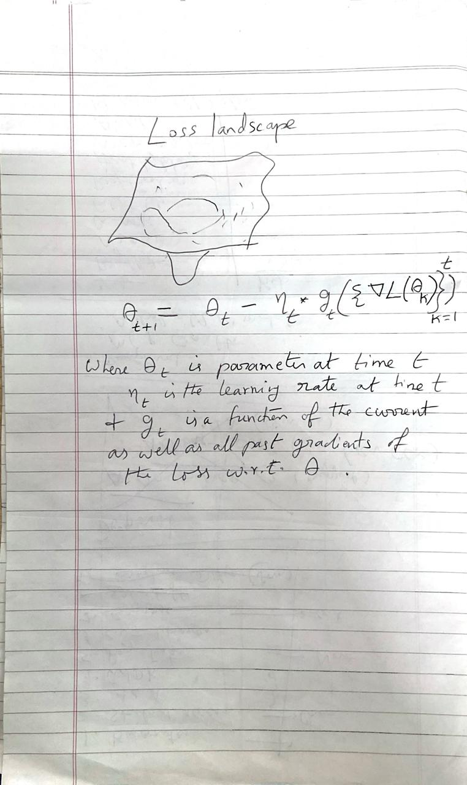
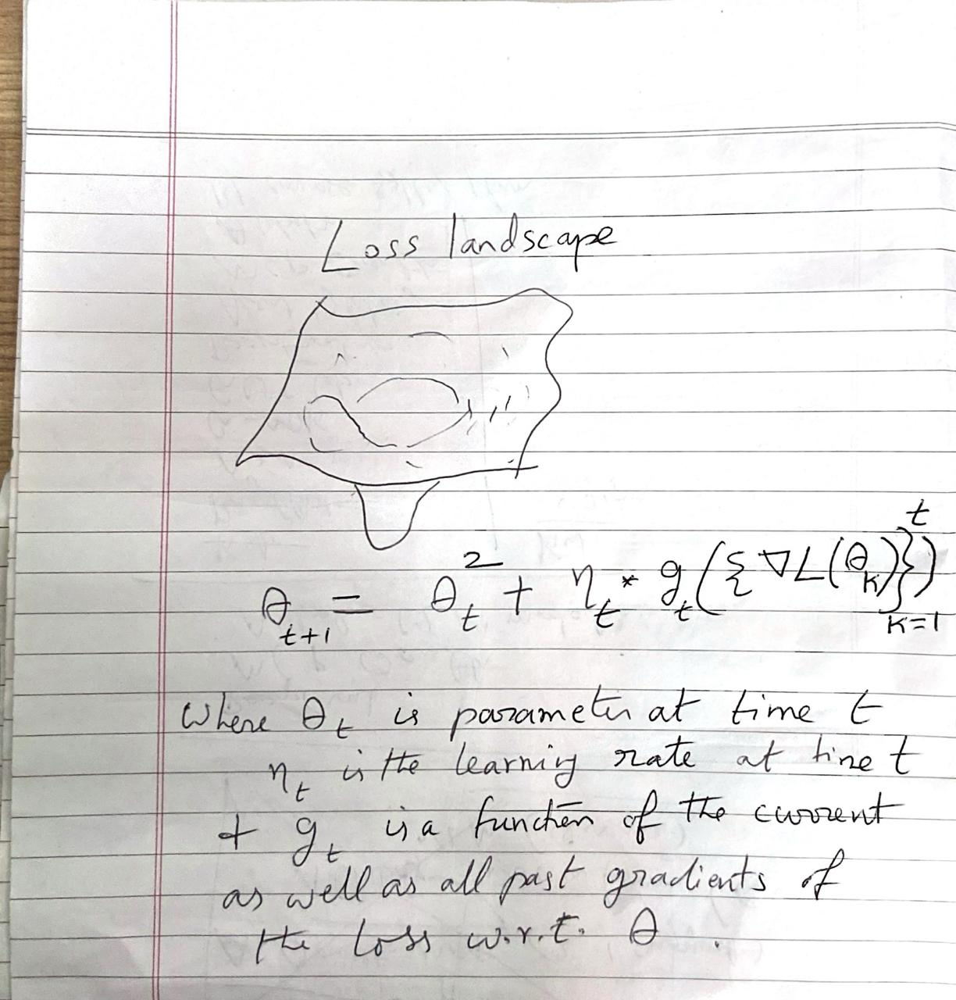

<!-- _class: lead -->
<!-- _paginate: false -->

# Prompt engineering

## Twelve prompting techniques, and prompting with images

`01_prompting_techniques.ipynb` → `02_vl_call.ipynb` → `03_vl_litellm_call.ipynb`

---

## Roadmap

| Part | What | Notebook | Time |
|---|---|---|---:|
| **0** | Setup: the cluster, `get_completion`, structured outputs with Instructor | 01 | 15 min |
| **1** | Techniques in a single call: zero-shot, few-shot, role, CoT, ToT, meta-prompting | 01 | 30 min |
| **2** | Techniques as pipelines of calls: chaining, least-to-most, recursive, Reflexion, self-consistency | 01 | 25 min |
| **3** | Techniques with tools: ReAct | 01 | 15 min |
| | *Break* | | *10 min* |
| **4** | Vision-language prompting: raw OpenAI client, then LiteLLM | 02, 03 | 25 min |
| **5** | Pitfalls, takeaways, exercises (+ optional CO-STAR appendix) | | 10 min |

<!--
Timings assume about 2 hours plus a 10-minute break; adjust to the actual slot. Check WireGuard access to the cluster before class.
-->

---

## Where this lab fits

| Lab | Focus |
|---|---|
| Last week's `prompts` lab | API fundamentals: sampling settings, chat vs. API, **structured outputs with Instructor**, naive vs. CO-STAR prompts |
| **This lab, notebook 01** | Twelve classic **prompting techniques**, each with a description, an example and a structured (Pydantic) implementation |
| **This lab, notebooks 02–03** | **Vision-language** prompting: an image plus a question in one call |

**Models**, all on the SupportVectors cluster's OpenAI-compatible endpoint (WireGuard required):
- Notebook 01: `openai/gpt-oss-20b`, an open-weight **reasoning** model (it thinks before it answers).
- Notebooks 02–03: `Qwen/Qwen3-VL-8B-Instruct`, a compact (8-billion-parameter) **vision-language** model.

---

<!-- _class: part -->

# Part 0
## Setup and structured outputs
`01_prompting_techniques.ipynb`

---

## Connecting to the cluster

```python
client = instructor.from_openai(
    OpenAI(
        base_url=os.environ["OPENAI_BASE_URL"],   # http://10.0.10.70:8000/v1 (from .env)
        api_key=os.environ["OPENAI_API_KEY"],     # a dummy key; the cluster doesn't check it
    ),
    mode=instructor.Mode.JSON,
)
```

- The cluster speaks the **OpenAI API**, so the standard `OpenAI` client works. Only `base_url` changes.
- `instructor.from_openai(...)` wraps the client so that `create()` accepts a **`response_model`** (a Pydantic class) and returns a validated Python object instead of raw text.
- **`Mode.JSON`**: Instructor asks for a JSON answer matching the schema. The comment in the notebook explains why: gpt-oss-20b sometimes emits several tool calls at once, which Instructor's default *tools* mode rejects.

---

## The helper every example uses: `get_completion`

```python
def get_completion(prompt, model="openai/gpt-oss-20b", temperature=0.7, response_model=None):
    messages = [ChatCompletionUserMessageParam(role="user", content=prompt)]
    if response_model is not None:
        return client.chat.completions.create(          # → a validated Pydantic object
            response_model=response_model, model=model,
            messages=messages, temperature=temperature)
    response = client.chat.completions.create(          # → plain text
        response_model=None, model=model,
        messages=messages, temperature=temperature)
    return response.choices[0].message.content
```

- One **user** message and no system message. Every technique in the notebook is expressed purely through the text of that one prompt, plus the Pydantic schema.
- `temperature` varies by example: **0.3** for precise answers, **0.7** for varied or creative ones.

---

## How a Pydantic schema becomes part of the prompt

```python
class CoTResponse(BaseModel):
    steps: List[str] = Field(description="List of reasoning steps")
    final_answer: str = Field(description="The final answer after reasoning")
```

What Instructor does on each call:

1. Converts the class into a **JSON schema**: field names, types, and each `Field(description=...)`.
2. Adds that schema to the request, so **the field names and descriptions are prompt text too**.
3. Parses the model's JSON reply and **validates** it against the class (types, required fields, `Literal` choices).
4. If validation fails, it can send the error back to the model and **retry** (`max_retries`).

> Two consequences we'll see all day: **descriptions steer the model**, and **field order is the order the model writes in**. `steps` comes before `final_answer`, so the model reasons first and answers last.

---

## A map of the twelve techniques

Grouped by **how the code calls the model**, which is the most useful way to remember them:

| Pattern | Techniques | LLM calls per example |
|---|---|---|
| **One call, a cleverly worded prompt** | Zero-shot · Few-shot · Role · Chain of Thought · Tree of Thought · Meta-prompting* | 1 |
| **A pipeline of calls**, each output feeding the next | Prompt chaining · Least-to-most · Recursive · Reflexion · Self-consistency | 2 to 6 |
| **A loop with tools**, where observations come from outside the model | ReAct | up to 5 steps + 1 |

<small>* Meta-prompting makes a second call to *use* the prompt it generated.</small>

---

<!-- _class: part -->

# Part 1
## Techniques in a single call

---

## Zero-shot prompting

Just ask. **No examples**; the model relies on what it learned in pre-training.

```python
class TranslationResponse(BaseModel):
    original_text: str
    translated_text: str
    language: str

prompt = "Translate this sentence to French: 'Hello, how are you?'"
```

**Output:** `Bonjour, comment ça va ?`

- The notebook's markdown example says *"Bonjour, comment allez-vous ?"*. The model chose the **informal** version instead.
- Neither is wrong. The prompt never said *who* is being addressed, so the model picked a register.
- **Lesson:** zero-shot works when the task is unambiguous. Every detail you leave out, the model decides for you.

---

<!-- _class: small -->

## Few-shot prompting

Show **input → output examples**, then give the new input.

```text
Task: Analyze the sentiment and key topics in customer feedback.

Example 1:  Input: "The new mobile app interface is intuitive … login … takes too long …"
            Output: {"sentiment": "mixed", "key_topics": [...], "positive_aspects": [...], ...}
Example 2:  (positive feedback)   →  {"sentiment": "positive", ...}
Example 3:  (negative feedback)   →  {"sentiment": "negative", ...}

Now, analyze this new feedback:
Input: "The new dashboard layout is confusing … data visualization features are great, but hard to find …"
Output:
```

**Output:** sentiment **mixed**; positives: data visualization features, export functionality; negatives: dashboard layout, **"hard to find features"**, limited file formats, overall user experience.

- The examples teach the **format**, and just as importantly the **granularity**: short noun phrases, and suggestions phrased as actions.
- Note the nuance: "great features, but hard to find" became a positive (the features) *and* a separate negative (finding them).
- **Good examples:** cover each label (mixed, positive, negative), vary in content, and match the real inputs' length and style.

---

## Role prompting: same question, two personas

```python
prompt_good = "You are an experienced chef with 20 years of experience in French cuisine.
               Please explain how to make a perfect béarnaise sauce."

prompt_bad  = "You are a musician with 20 years of experience in music production.
               Please explain how to make a perfect béarnaise sauce."
```

Both are sent with the same schema (`title`, `ingredients`, `steps`, `tips`) at **temperature 0.1**, so the difference comes from the prompt rather than from sampling luck.

> **Before the next slide:** which persona will give the better recipe?

---

<!-- _class: small -->

## Role prompting: what changed with the persona

| | **"Chef" persona** | **"Musician" persona** |
|---|---|---|
| Ingredients | 3 yolks, ¼ cup vinegar, ¼ cup wine, 2 tbsp shallots, tarragon, **chervil**, parsley, lemon, ½ cup butter | 2 yolks, ¼ cup vinegar, **1 tbsp** wine, 1 tbsp shallots, tarragon, ½ cup butter |
| Method | Reduces vinegar, wine, shallots and herbs to ~2 tbsp, strains, whisks in the yolks over a double boiler, drizzles in butter, **finishes with fresh tarragon** | Same reduction and emulsion, but then says to "stir in the strained reduction" **a second time**, although it's already in the bowl |
| Tips | 6 tips, including "a rapid boil will make the reduction bitter" and how to reheat gently | 5 more general tips (gentle heat, rescue, keeping it warm) |

- **Both** use the classic method: reduce first, then emulsify. The model knows the recipe whatever the persona.
- The **chef** version is more complete and more precise: chervil is part of the classic béarnaise, the herbs are finished fresh, and the tips are more expert. The **musician** version is thinner and has a step that doesn't make sense.
- **Lessons:** a persona shifts **depth, detail and polish** more than core facts. **Temperature matters for comparisons:** at 0.7 one sample per persona can flip the result from run to run. And a role helps most when it carries **real instructions** (audience, standards, constraints), not just a job title.

---

<!-- _class: small -->

## Chain of Thought (CoT)

Ask the model to **show intermediate steps** before the answer.

```python
prompt = """Question: A company has 3 departments with 25, 30, and 35 employees respectively.
Each department needs to send 20% of its employees to a training program. The training program
costs $500 per person. What is the total cost of the training program?

Let's solve this step by step:"""
# response_model = CoTResponse  (steps: List[str], then final_answer: str)
```

**Output steps:** 20% of each → 5, 6, 7 → total 18 → 18 × $500 → **$9,000** ✓

- "Let's solve this step by step" is the classic zero-shot CoT trigger (Kojima et al., 2022). CoT itself is from Wei et al. (2022).
- **Why it helps:** a model produces text one token at a time. Writing the intermediate results down gives it room to compute before committing to an answer.
- **Schema order enforces it:** `steps` comes before `final_answer`.
- gpt-oss-20b is a **reasoning model**: it already thinks privately before answering. Explicit CoT matters most for non-reasoning models, but it still gives you an **auditable** trace.

---

<!-- _class: small -->

## Tree of Thought (ToT): the idea vs. this implementation

**The research idea** (Yao et al., 2023): treat reasoning as a **search**.
1. Generate several candidate "thoughts" (partial solutions) at each step.
2. **Evaluate** each one (often with another model call).
3. Expand the promising ones, **backtrack** from dead ends, using breadth- or depth-first search.

**What the notebook does:** *one* call asking for several solution paths, then "choose the best one".

```python
class ToTResponse(BaseModel):
    paths: List[SolutionPath]      # path_name, steps, result
    best_path: str
    final_answer: float
    reasoning: str
```

**Output:** three paths for "60 mph for 2.5 hours" (direct multiplication, unit conversion, the average-speed concept), all giving **150**. It picks "Direct Multiplication" as the simplest.

- It's a useful **ToT-style prompt**: it makes the model consider alternatives. But there's no evaluation step between thoughts and no backtracking, so it isn't a search.
- For a problem this easy, every path agrees. ToT earns its cost on problems with **dead ends** (puzzles, planning).

---

<!-- _class: small -->

## Meta-prompting: a prompt that writes a prompt

```python
prompt = """Task: Create a prompt that will help generate creative story ideas.
Create a prompt that will: 1. Specify the genre and tone  2. Include key elements to consider
                           3. Provide structure for the story  4. Set clear constraints and requirements"""
response = get_completion(prompt, temperature=0.7, response_model=PromptTemplate)
#   → title, purpose, components[], constraints[]

second_response = get_completion(prompt=f"Write a story using {response}", response_model=None)
```

**Step 1:** a sensible template (genre and tone, key elements, structure, and 6 constraints such as "at least three distinct main characters").

**Step 2:** a story concept that follows it: 1928 New York, a librarian who finds a time-traveller's diary, a street magician, and a twist ending, laid out under the template's headings.

- **But look at how it's wired:** `{response}` inserts the Pydantic object's printout (`title='…' purpose='…' components=[…]`), which is a *description* of a prompt, not a prompt. It worked in this run, but it's fragile: in another run the model simply tidied up the template and wrote no story.
- **Fix:** give the schema a `prompt_text: str` field that holds the finished prompt, and send **that text** as the second call's prompt.
- **Lesson:** in any multi-call technique, look at **exactly what string** gets passed along.

---

<!-- _class: part -->

# Part 2
## Techniques as pipelines of calls

---

## Prompt chaining

Break a task into **small prompts**, each using the previous output.

```python
summary    = get_completion(f"Summarize the following text in one sentence:\n{text}",
                            temperature=0.3, response_model=SummaryResponse).summary
key_points = get_completion(f"Extract 3 key points from this summary:\n{summary}",
                            temperature=0.3, response_model=KeyPointsResponse).key_points
questions  = get_completion(f"Generate 2 questions based on these key points:\n{key_points}",
                            temperature=0.7, response_model=QuestionsResponse).questions
```

```text
climate text ──► summary (1 sentence) ──► 3 key points ──► 2 questions
```

- **Each step is simple**, so each is easier to get right, test and debug on its own.
- **Each step can use its own settings:** low temperature for extraction, higher for generating questions.
- You can **check or fix** the output between steps, for example by validating that there really are 3 key points.
- **The cost:** more calls, more latency, and an early mistake flows into every later step.

---

<!-- _class: small -->

## Least-to-most prompting

Two phases (Zhou et al., 2022): **decompose** the problem into sub-problems, then **solve them in order**, each using the earlier answers.

```python
breakdown = get_completion(breakdown_prompt, temperature=0.3, response_model=List[str])   # phase 1
for i, step_description in enumerate(breakdown, 1):                                       # phase 2
    step_prompt = f"""We are solving: … 3 shirts at $25 each with a 20% discount and 8% tax.
    Current step ({i}): {step_description}
    Previous steps results: {current_result}"""
    step_result = get_completion(step_prompt, temperature=0.3, response_model=CalculationStep)
    current_result = step_result.result
```

| Step | 1. Subtotal | 2. Discount | 3. Discounted subtotal | 4. Tax | 5. Total |
|---|---|---|---|---|---|
| Calculation | 3 × $25 = 75 | 0.20 × 75 = 15 | 75 − 15 = 60 | 0.08 × 60 = 4.8 | 60 + 4.8 = **$64.80** ✓ |

- **Only the previous step's number is passed on.** Step 3 needs *both* 75 and 15 but is told only "15"; the model recomputed 75 itself. The original method passes **all** earlier questions and answers.
- The printed breakdown shows "1. 1. Calculate…": the model already numbered its list items, and the loop numbers them again.

---

<!-- _class: small -->

## Recursive prompting

Feed the model's output back in as the next input: **outline → expand → review**.

```python
outline = get_completion("Generate a basic outline for a mystery novel", response_model=OutlineResponse)
chapter = get_completion(f"Using this outline, expand the first chapter with more detail:\n{outline}",
                         response_model=ChapterResponse)
review  = get_completion(f"Review this chapter and suggest improvements to the plot:\n{chapter}",
                         response_model=ReviewResponse)
```

**Output:**
- **Outline:** *Shadows on Maple Street*: a prologue, 6 chapters and an epilogue
- **"First chapter":** the model expanded the **Prologue** (`chapter_number=0`): a matriarch vanishes from a locked house, leaving a crimson rose petal. "First chapter" was ambiguous, so the model decided.
- **Review:** strengths (atmosphere, a clear inciting incident, a symbolic clue) and weaknesses (predictable, no suspects yet, slow and exposition-heavy), plus 8 concrete suggestions.

- The natural next step, not in the notebook, is to **close the loop**: feed the review back and rewrite the chapter.
- `ChapterResponse` asks the model for its own `word_count`. This time its 586 matches a count done in code, but models often miscount, so compute such numbers in code.

---

## Reflexion: solve, then check yourself

```python
initial_solution = get_completion("Solve the equation: 2x + 5 = 15 … step by step",
                                  response_model=InitialSolution)          # call 1
reflection = get_completion(f"""You previously solved … Your solution was: {initial_solution.solution}
                                Please reflect on your solution and provide verification steps.""",
                            response_model=ReflexionResponse)              # call 2
```

**Output:** x = 5. Verification: 2 × 5 + 5 = 15 ✓. `is_correct = True`, so there's nothing to correct.

- **The research version** (Shinn et al., 2023) is richer: an agent attempts a task, gets **external feedback** (for example, unit tests fail), writes a short **verbal reflection** into memory, and retries with it.
- This notebook shows the core **self-verification** step. With an easy equation, the reflection has nothing to catch.
- Self-checks work best when the check is **easier or different** from the task (substituting x back in, running the code), not when the model simply re-reads its own words.

---

<!-- _class: small -->

## Self-consistency: the idea vs. this implementation

**The research idea** (Wang et al., 2022): sample the **same** question several times at temperature > 0, then take a **majority vote** over the final answers. Independent samples make different mistakes, and the right answer tends to win.

**What the notebook does:** *one* call asking for "3 different ways", then a second call to judge whether they agree.

**Output:** direct multiplication, converting to minutes, and the rate-time-distance formula all give **150**, so `is_consistent = True`.

- Three paths written **in one response** aren't independent: the model knows what it wrote in path 1 while writing path 2.
- The second call reuses `SelfConsistencyResponse`, so the model has to regenerate `paths` just to fill in the analysis.

A faithful version is only a few lines:

```python
from collections import Counter
answers = [get_completion(question, temperature=0.8, response_model=CoTResponse).final_answer
           for _ in range(5)]                              # 5 independent samples
answer, votes = Counter(answers).most_common(1)[0]         # majority vote
```

---

<!-- _class: part -->

# Part 3
## Techniques with tools: ReAct

---

## ReAct: reason, act, observe, repeat

**The idea** (Yao et al., 2022): interleave **Thought** (reasoning), **Action** (calling a tool) and **Observation** (the tool's result), until the model can answer.

```text
Thought:      High CPU after a deploy. I should look at system metrics first.
Action:       check system metrics
Observation:  CPU 90%, memory 80%, DB connections 100/100      ← comes from the TOOL
Thought:      Connections are maxed out. Check the logs …
```

- **The key point:** observations come from the **outside world**, not from the model. That's what lets ReAct use facts the model doesn't have (live metrics, search results, databases).
- It's the basic pattern behind today's **agents**.

---

<!-- _class: small -->

## ReAct in the notebook: the moving parts

```python
ActionDescription = Literal["check system metrics", "analyze code changes",
                            "review database schema", "check logs"]

class ReActStep(BaseModel):
    thought: str
    action: str                               # free-form command, e.g. "get_metrics"
    action_description: ActionDescription     # MUST be one of the four tool labels
    observation: str                          # placeholder; replaced by the tool's result

while current_step < max_steps:               # max_steps = 5
    response = get_completion(prompt + history, temperature=0.3, response_model=ReActStep)
    action_result = simulate_action(response.action_description)   # the "tool"
    history += [f"Thought: …", f"Action (…): …", f"Observation: {action_result}"]
    if "final answer" in response.thought.lower() or "solution" in response.thought.lower():
        break
final = get_completion(prompt + history, response_model=FinalAnswer)
```

- **`Literal[...]`** forces the model to pick one of four tool names. Instructor rejects anything else, so every action maps to a real tool.
- `simulate_action` returns canned results. In a real system these would be actual API calls.
- The model's own `observation` is **thrown away** and replaced with the tool's result, so the model can't make up what it "saw".

---

<!-- _class: small -->

## ReAct: what happened

| Step | Thought (shortened) | Tool chosen | Observation |
|---:|---|---|---|
| 1 | Slowdown after a deploy: gather system metrics | check system metrics | CPU 90%, memory 80%, DB connections 100/100 |
| 2 | High CPU and memory: review what the deploy changed | analyze code changes | Deploy removed the index on `customer_data` |
| 3 | A missing index is likely: look for slow queries in the logs | check logs | Multiple database connection timeouts |
| 4 | Confirm the missing index in the schema | review database schema | Queries do full table scans |
| 5 | Find exactly which queries are slow: the slow-query log | check logs **(again)** | (same as step 3) |

**Final answer:** the deploy removed the index on `customer_data`; queries now do full table scans, driving up CPU and memory and causing connection timeouts. Re-create the index (`CREATE INDEX … ON customer_data(columnX)`, "replace columnX with the actual column"), redeploy and verify.

- A sensible diagnosis, reached by **gathering evidence one tool at a time**.
- But look at **step 5**: the diagnosis was complete after step 4, yet the model kept investigating and got a repeated observation. Next slide.

---

## Why ReAct ran all 5 steps

```python
if "final answer" in response.thought.lower() or "solution" in response.thought.lower():
    break
```

- The loop stops only if the model *happens* to write "final answer" or "solution" in its thought.
- None of the thoughts used those words. Step 4 wanted "to confirm the missing index and plan a **fix**", and step 5 wanted to "inspect the slow query log". No keyword, so no stop: the loop ran until `max_steps`.
- **Stopping on keywords in free text is fragile.** Better options:
  - Add a field to the schema, such as `done: bool`, or a fifth tool, `"finish"`, that the model picks when it's ready to answer.
  - Stop if the model repeats the same tool call.
  - Keep `max_steps` as a safety limit (as here), and count tokens and cost.

> **General lesson:** let the model signal decisions through **structured fields**, not through words you hope it will use.

---

## Choosing and combining techniques

| If you need… | Reach for… |
|---|---|
| A simple, well-defined task | **Zero-shot**, with the details spelled out |
| A specific format, style or level of detail | **Few-shot** examples (plus a schema) |
| Multi-step reasoning you can check | **Chain of Thought**, with steps before the answer in the schema |
| Exploring alternatives on hard problems | **Tree of Thought**, done as a real search |
| More reliable answers | **Self-consistency**: independent samples plus a vote |
| A task that's too big for one prompt | **Prompt chaining** / **least-to-most** |
| Facts the model doesn't have | **ReAct** with real tools |
| A way to catch mistakes | **Reflexion**, with an external check |

- **Combine them:** for example, few-shot examples *of* chain-of-thought solutions.
- **Temperature:** about 0.3 for precise tasks, 0.7 for balanced ones, 0.9 for creative ones (the notebook's own guideline).

---

<!-- _class: part -->

# Break (10 min)

---

<!-- _class: part -->

# Part 4
## Vision-language prompting
`02_vl_call.ipynb` → `03_vl_litellm_call.ipynb`

---

<!-- _class: small -->

## Sending an image in a chat message

```python
def image_to_base64(path: str) -> str:
    with open(path, "rb") as f:
        return base64.b64encode(f.read()).decode("utf-8")      # bytes → text

response = client.chat.completions.create(
    model="Qwen/Qwen3-VL-8B-Instruct",
    messages=[{
        "role": "user",
        "content": [                                             # a LIST of content parts
            {"type": "text", "text": "I am a physics student … Put this explanation as a
                                     tutorial in a latex document."},
            {"type": "image_url",
             "image_url": {"url": f"data:image/jpeg;base64,{image_b64}"}},
        ],
    }],
    max_tokens=10000,
)
```

- `content` can be a **list of parts**, mixing text and images in one message.
- The image travels **inside the request** as a base64 **data URL**. A normal `https://…` image URL also works if the server can reach it.
- The model turns the image into **tokens**, just like text. In these runs, the photo plus the two-line question came to **1,000 prompt tokens**. The answers used 1,675 (notebook 02) and 4,619 (notebook 03) output tokens.

---

<!-- _class: pics -->

## The three images used in the lab

  

`phys_img.jpeg` (notebooks 02 and 03) · `update_rule.jpeg` and `update_error.jpeg` (notebook 03)

---

<!-- _class: small -->

## Call 1: "explain these notes as a LaTeX tutorial"

**The prompt** gives the audience ("I am a physics student"), the task ("explain it") and the output format ("a tutorial in a LaTeX document").

**What came back** (notebook 02): straight away, a LaTeX document with sections on the boundary operator, Gauss's law for magnetism, "why no magnetic monopoles", and an optional section on differential forms.

- **Correct pieces:** ∂²M = 0 with examples (a disk's boundary is a circle; a circle has no boundary), ∇ · **B** = 0 and the divergence theorem, and d² = 0 for differential forms.
- **The weak spot is the key step.** It says the divergence is "analogous to" the boundary operator and that ∂²M = 0 "implies" field lines can't end. The real mechanism (next slide) appears only briefly, in the optional section.
- It reads well and compiles, which makes the gap **easy to miss**. That's why you check an answer against what it *should* contain.

---

<!-- _class: small -->

## What a correct answer needs to say

The chain of reasoning the notes are pointing at:

1. **∂∂ = 0** (the boundary of a boundary is empty) has a twin for derivatives: **d² = 0**. In vector calculus it's **∇ · (∇ × A) = 0**, "the divergence of a curl is zero".
2. The magnetic field comes from a vector potential: **B = ∇ × A**.
3. So **∇ · B = ∇ · (∇ × A) = 0**: magnetic field lines have no sources or sinks, which means **no magnetic monopoles**.
4. The same argument in integral form uses Stokes' theorem. The flux out of a closed surface S is $\oint_S \mathbf{B}\cdot d\mathbf{S} = \oint_{\partial S} \mathbf{A}\cdot d\mathbf{l}$. A closed surface is itself a boundary (S = ∂V), so ∂S = ∂∂V = ∅ and the flux is **0**.
5. **Caveat:** this needs **A** to be defined everywhere. With non-trivial topology (Dirac's monopole, with its "string"), monopoles become possible.

> Use a checklist like this to **grade** a model's answer, instead of judging it by how polished it looks.

---

<!-- _class: small -->

## Notebook 03: the same calls through LiteLLM

```python
from litellm import completion

response = completion(
    model="openai/Qwen/Qwen3-VL-8B-Instruct",      # "openai/" prefix = an OpenAI-compatible server
    messages=[ ...the same text + image_url parts... ],
    max_tokens=10000,
    api_base=os.environ["OPENAI_BASE_URL"],        # which server
    api_key=os.environ["OPENAI_API_KEY"],
)
response_text = response["choices"][0]["message"]["content"]
```

| | OpenAI client (notebook 02) | LiteLLM (notebook 03) |
|---|---|---|
| Works with | OpenAI-compatible servers | **100+ providers** (OpenAI, Anthropic, Bedrock, vLLM, Ollama, …) |
| Choosing the provider | `base_url` on the client | **prefix** on the model name, e.g. `openai/…`, `anthropic/…` |
| Message format | OpenAI chat format | the **same** OpenAI chat format for every provider |
| Response | `response.choices[0].message.content` | the same, or dict-style `response["choices"][0]…` |

- **Why LiteLLM:** swap models or providers by changing **one string**. It also offers retries, fallbacks and cost tracking.
- The `openai/` prefix is **stripped** before the request, so the server still sees `Qwen/Qwen3-VL-8B-Instruct`.

---

<!-- _class: small -->

## Same prompt, same model, a different answer

Notebook 03 sends **exactly the same** physics request as notebook 02, through LiteLLM. The answer is very different:

| | Notebook 02 (OpenAI client) | Notebook 03 (LiteLLM) |
|---|---|---|
| Shape | A LaTeX document straight away | A long markdown tutorial first, *then* a LaTeX version |
| Length | 1,675 output tokens | 4,619 output tokens |
| Quality | Hand-wavy at the key step | Corrects itself mid-answer **four times** ("Wait — that's not quite right"), then argues wrongly that monopole charge density "would have to be constant" |
| Extras | | Invents a date for the tutorial ("April 2025") |

- **Why:** neither call sets `temperature`, so the server's default sampling applies, and each run is a different draw. LiteLLM isn't the cause.
- **A small model shows its seams.** An 8B model can write fluent physics and still reason badly. The self-corrections are visible here; usually they aren't.
- **Lessons:** set `temperature` explicitly when you compare clients, prompts or models. Run more than once. Grade against a checklist like the one on the previous slide.

---

<!-- _class: small -->

## Call 2: "explain this diagram and give PyTorch code"

The image (`update_rule.jpeg`) shows a loss landscape and:

$$
\theta_{t+1} = \theta_t - \eta_t \, g_t\!\left(\{\nabla L(\theta_k)\}_{k=1}^{t}\right)
$$

θ_t = the parameters at step t, η_t = the learning rate, g_t = a function of the current **and all past** gradients.

**What came back:**
- **A correct reading** of the equation and of g_t as "a function of all past gradients", with momentum, RMSProp and Adam as examples. A good start.
- **Overreach:** it declares the diagram "highly suggestive of the Adam optimizer". The equation is the **general template** for all these optimizers; nothing in it points to Adam.
- **A mislabel:** it calls g_t = ∇L(θ_t) + β g_{t−1} "Nesterov (NAG)". That's classical momentum; Nesterov evaluates the gradient at a look-ahead point.
- **Thin code:** the PyTorch part just calls `torch.optim.Adam`. It never implements the g_t in the diagram.

- **Prompt lesson:** "explain" + "give code" gets you *something* for both, but not necessarily what you meant. Say what you want: "implement g_t yourself as a custom `torch.optim.Optimizer`".

---

<!-- _class: small -->

## Call 3: "identify errors and fix them", and what the model missed

`update_error.jpeg` is the same page with **two deliberate errors**:

$$
\theta_{t+1} = \theta_t^{\,2} \;+\; \eta_t \, g_t(\ldots) \qquad \text{instead of} \qquad \theta_{t+1} = \theta_t \;-\; \eta_t \, g_t(\ldots)
$$

| Deliberate error | Did the model catch it? |
|---|---|
| **+** instead of **−** (the step goes *uphill*) | **Yes**, as the last of 7 listed "errors": "Missing negative sign". |
| **θ_t²**: the parameters are squared | **Misread.** It transcribed the equation as θ = θ_t + η_t · g(ξ∇L(θ_k))², moving the ² to the end and reading the curly brace **{** as a symbol **ξ**. |

- The other 5 "errors" it lists are **spurious**: complaints about the invented ξ, about ∇ notation, and about the summation index.
- Its PyTorch note is also wrong: it says `torch.optim.SGD(momentum=0.9)` computes v = βv + (1 − β)g. PyTorch actually uses **v = μv + g** (with the default `dampening=0`).

- **Lesson:** vision models **misread handwriting**, especially small superscripts and subscripts. A confident, well-formatted answer can rest on a wrong transcription.
- **A better prompt:** first *"Transcribe the equation exactly, symbol by symbol"*, check that transcription, and only then *"Now identify the errors"*. That's prompt chaining applied to images.

---

## Tips for prompting with images

- **Transcribe first, reason second.** Ask for a verbatim transcription of any text or equations, then the analysis. Mistakes become visible and easy to correct.
- **Say who it's for and what format you want**, as call 1 did ("physics student", "LaTeX tutorial").
- **Ask for uncertainty.** For example: "If any symbol is unclear, say so instead of guessing."
- **Image quality matters.** Crop to the relevant region, keep it readable, and remember that bigger images cost more tokens.
- **Leave room for the answer.** The notebooks set `max_tokens=10000` because they ask for whole documents and code. The longest answer here used 4,619 tokens.
- **Verify** anything that matters: compile the LaTeX, run the code, check the math.

---

<!-- _class: part -->

# Part 5
## Pitfalls, takeaways and exercises

---

<!-- _class: small -->

## Pitfalls in the lab code

1. **ReAct stops on keywords.** The stop check looks for "final answer" or "solution" in free text, so this run used all 5 steps and repeated a tool. Use a `done` field or a `finish` tool.
2. **Self-consistency and ToT are single-call imitations.** Self-consistency needs **independent** samples and a vote. ToT needs evaluation and backtracking.
3. **Least-to-most passes only the last number** forward, not all earlier answers. It also prints double numbering ("1. 1.").
4. **Meta-prompting passes a Pydantic printout**, not a finished prompt. It worked in this run, but in another the model just rewrote the template instead of writing a story.
5. **The role-prompting demo** is still one sample per persona. Temperature 0.1 makes it a fairer comparison, but draw conclusions from several runs, not one.
6. **The vision calls don't set `temperature`**, so notebooks 02 and 03 get different answers to the same request. Set it explicitly whenever you compare.
7. **Small code issues:** `image_to_base64` is defined three times in notebook 03; the data URL always says `image/jpeg`; the "Best Practices" `format_response` snippet uses a bare `except:` and never imports `json`.

---

## Key takeaways

- **A technique is a pattern of calls**, not a magic phrase: one call, a pipeline, or a loop with tools.
- **Structured outputs are part of the prompt.** Field names, descriptions, order and `Literal` choices all steer the model, and they give you **checkable** results.
- **Be precise about what you pass between calls.** Most multi-call bugs are about *which string* goes into the next prompt.
- **Names aren't implementations.** "Self-consistency" and "Tree of Thought" in the notebook are simplified; know what the real method does.
- **Let the model signal decisions with fields** (`done`, a chosen tool), not with words you hope it will write.
- **Images are just more tokens**, and they can be misread. Transcribe first, then reason, then verify.
- **Evaluate, don't trust.** One run, one persona or one confident answer proves little.

---

## Exercises

1. **Fix ReAct:** add `done: bool` to `ReActStep` (or a `"finish"` tool) and stop when it's set. How many steps does the diagnosis take now?
2. **Real self-consistency:** sample the CoT problem 5 times at temperature 0.8 and take a majority vote. Try a harder problem where the samples disagree.
3. **Fix meta-prompting:** add `prompt_text: str` to `PromptTemplate`, and send that text in the second call. Run it 5 times: do you get a story every time?
4. **Role prompting, properly:** run each persona 3 times at temperature 0.1 and 3 times at 0.9. Which matters more for the recipe's quality, the persona or the temperature?
5. **Transcribe first:** for `update_error.jpeg`, ask for an exact transcription first, then for errors. Does the model now spot θ_t², and stop inventing ξ?
6. **Swap models with LiteLLM:** change only the `model` string to run the error-finding call on a larger vision model you have access to. Use the same temperature, and compare against the two deliberate errors.

---

<!-- _class: part -->

# Appendix (optional)
## CO-STAR prompts in the `prompts/` folder

---

<!-- _class: small -->

## Naive vs. structured: the glossary prompts

**CO-STAR** is a template for structured prompts: **C**ontext, **O**bjective, **S**tyle, **T**one, **A**udience, **R**esponse. The repo's version uses sections for Role, Style, Tone, Audience, Goal, Safeguards and Response.

| | `00_naive_glossary_prompt.md` | `01_costar_glossary_prompt.md` |
|---|---|---|
| The prompt | One line: *"Create a glossary of terms used in Prompt Engineering."* | About 2,600 characters in 8 sections: an expert role, a technical style, a formal tone, an audience of engineers, the required contents of each entry, "Do NOT make things up", at least 300 tokens per term, HTML inside JSON |
| The result | `results/simple_glossary.md`: **20 one-sentence** definitions, 3.6 KB in total | `results/co_star_glossary.json`: **20 terms** averaging about **3,500 characters each**, with components, examples, pros and cons, and use cases |

- Structure changes the **depth, format and consistency** of the output dramatically.
- It doesn't fix **what** gets chosen: the CO-STAR list includes "Positional Encoding" and "Gradient-based Optimization", which aren't really prompt-engineering terms.
- `02_costar_term_refinement_prompt.md` adds a second pass that critiques and rewrites each definition: **Reflexion-style refinement** as a pipeline.
